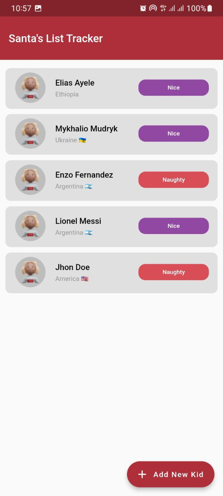
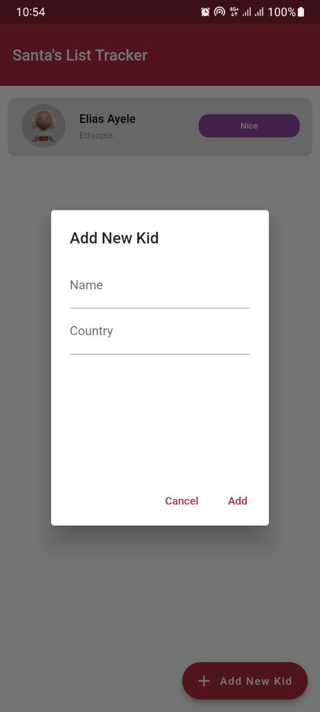

# Santas List Tracker

Santa's List Tracker is a mobile app developed in Flutter that helps Santa manage his Christmas list. The app keeps track of children's names, their home countries, and whether they have been naughty or nice.

## Screenshots

*Caption for Screenshot 1*

*Caption for Screenshot 2*

## Features

- **View List:** Display a list of children, showing their names, countries, and status (nice or naughty).
- **Add New Kid:** Add a new child to the list with their name, country, and an initial status.
- **Change Kid Status:** Modify the status of each child (nice or naughty) by tapping on their entry in the list.

## State Management

The app utilizes the BLoC (Business Logic Component) pattern for state management. BLoC helps organize and manage the app's state in a clear and efficient manner.

## Inspiration Design

The design of this app draws inspiration from [Design Inspiration Source](https://www.figma.com/proto/nFFzxeYGEdZkjsJ5ekvWFc/Untitled?type=design&node-id=1-5&t=HvwOWMKcMVDFsmJc-0&scaling=min-zoom&page-id=0%3A1).

## Getting Started

This project is a Flutter application. To get started:

1. Clone the repository: `git clone https://github.com/eliasayele/santa_list_tracker.git`
2. Navigate to the project directory: `cd santas_list_tracker`
3. Run the app: `flutter run`

For more detailed Flutter development instructions, refer to the [online documentation](https://docs.flutter.dev/).
